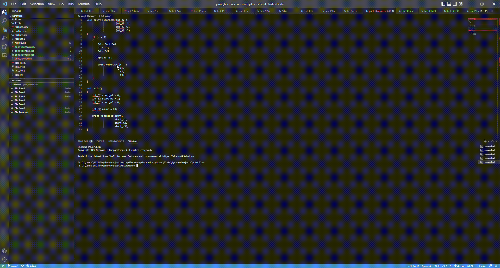

ucompiler
=========
Mini compiler built using PLY library.
Contains AST, IR, CodeGen.

Requirements
------------
[Python 3.9](https://www.python.org/downloads/) or higher \
[MASM32](https://www.masm32.com/download.htm) \
PLY library - ```pip install ply```

Run
---
python main.py examples\test_1.u\
examples\test_1.exe


